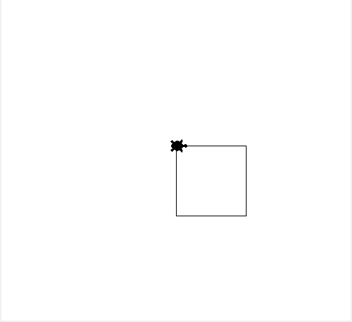
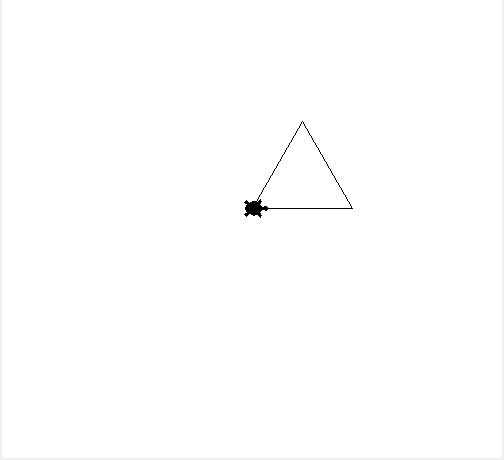
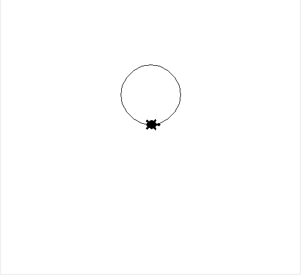

# Exercise Sheet

## 01: Draw a square

### Task

1. Create a function called `draw_square` that takes in one parameter: `turtle`.
2. Use the turtle object to draw a square of the given length.
3. Add the `draw_square` function to the app by appending it to the `exercise_list`

### Hints
- To draw a rectangle, use the turtle library.
- The turtle library provides a `forward` method that moves the turtle in the direction it is facing.
- The turtle library provides a `left` method that turns the turtle to the left.
- To change the turtle's pen color, use the `pencolor` method.
- To change the turtle's pen size, use the `pensize` method.

### Desired output

## 02: Draw a triangle

### Task

1. Create a function called `draw_triangle` that takes in one parameter: `turtle`.
2. Use the turtle object to draw a triangle.
3. Add the `draw_triangle` function to the app by appending it to the `exercise_list`

### Hints

- The angle between the sides of an equilateral triangle is 60 degrees

### Desired output

## 03: Draw a circle

### Task

1. Create a function called `draw_circle` that takes in one parameter: `turtle`.
2. Use the turtle object to draw a circle.
3. Add the `draw_circle` function to the app by appending it to the `exercise_list`

### Hints

- The turtle library provides a `circle` method that allows you to draw a circle.

### Desired output

## 04: Draw a star

### Task

1. Create a function called `draw_star` that takes in two parameters: `turtle`
2. Use the turtle object to draw a star.
3. Add the `draw_star` function to the app by appending it to the `exercise_list`

### Desired output

